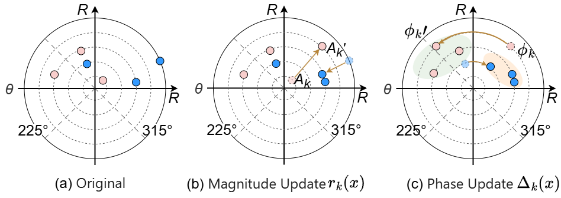
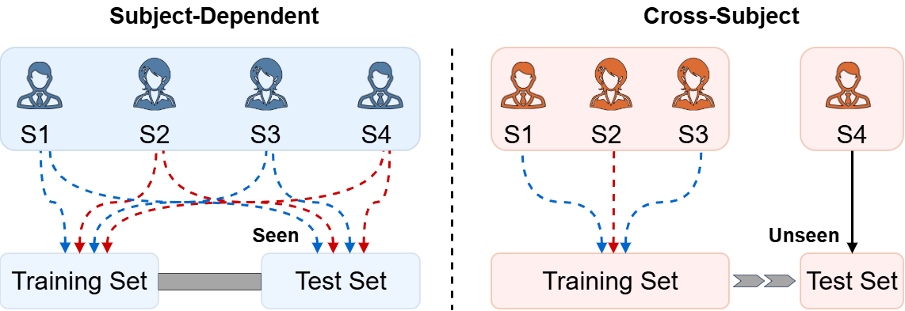

# BioFormer: Rethinking Cross-Subject Generalization via Spectral Structural Alignment in Biomedical Time-Series

[](https://openreview.net/forum?id=6I7yMzQBts)

---

## 📌 Overview

**BioFormer** is a Transformer-based framework for **cross-subject generalization** in biomedical time-series (BTS).

We propose a new perspective **spectral drift** to explicitly characterize subject-specific variability in frequency space. Based on this, BioFormer performs **spectral structural alignment** via:

- **Frequency-Band Alignment Module (FBAM)**  

Our approach achieves strong performance across **6 benchmark datasets**, outperforming **12 baselines**.

---

## 🧠 Key Insight: Spectral Drift

<p align="center">
  
</p>

Samples from different subjects exhibit similar global spectral patterns, while variability mainly appears as **band-wise magnitude and phase shifts**.

---

## 🏗️ Model Architecture

<p align="center">
  
</p>

BioFormer integrates:
- Multi-scale temporal encoding
- Frequency-domain alignment (FBAM)
- Adaptive normalization (SCLN)
- PyramidConvolutional Embedding (PCE)

---

## 🔬 FBAM Mechanism

<p align="center">
  
</p>

FBAM performs:
- **Magnitude scaling**
- **Phase rotation**

in Fourier subspaces, enabling interpretable alignment.

---

## 📊 Cross-Subject Performance

<p align="center">
  
</p>

BioFormer consistently improves performance across multiple datasets under strict cross-subject settings.

---

## 🙏 Acknowledgement

This work is built upon:

👉 [Medformer](https://github.com/DL4mHealth/Medformer)  

We sincerely thank the authors for their open-source contribution.

---

## ⚙️ Requirements

```bash
matplotlib==3.7.0
natsort==8.4.0
numpy==1.23.5
pandas==1.5.3
scikit_learn==1.2.2
thop==0.1.1.post2209072238
torch==2.4.1
tqdm==4.64.1
```

Install:

pip install -r requirements.txt

## 📊 Datasets

We evaluate on six datasets:

- APAVA
- ADFTD
- PTB
- PTB-XL
- BCI2a
- BCI2b

🔹 BCI Datasets 

Based on:

👉 https://github.com/ziyujia/ECML-PKDD_MMCNN

We adapt them into cross-subject setting.

Processed data:

👉 https://drive.google.com/drive/folders/1cpSyqhCAGl-NarfJWa-CmzPoG6TL6vVe?usp=sharing


## 🚀 Training & Evaluation

All commands are provided in:

experiments.ipynb


## 📖 Citation

```bibtex
@inproceedings{bioformer2026,
  title={BioFormer: Rethinking Cross-Subject Generalization via Spectral Structural Alignment in Biomedical Time-Series},
  author={Du, Guikang and Li, Haoran and Liu, Xinyu and Zhang, Zhibo and Gong, Xiaoli and Zhang, Jin},
  booktitle={ICML},
  year={2026}
}
```

## 📬 Contact

Guikang Du

Email: guikangdu@mail.nankai.edu.cn